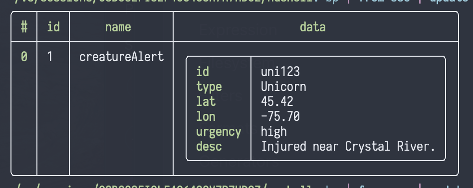

# [`nu`](https://www.nushell.sh) [streaming plugin](https://github.com/nushell/nushell/pull/11911): `nu_plugin_from_sse`

This plugin was forked from the
[nu_plugin_stream_example](https://github.com/nushell/nushell/tree/main/crates/nu_plugin_stream_example).

I'm looking to get a feel for how [nu
plugins](https://www.nushell.sh/contributor-book/plugins.html#plugins) work,
and in particular, what's possible with [@devyn](https://github.com/devyn)'s
new [streaming plugin
PR](https://github.com/nushell/nushell/tree/main/crates/nu_plugin_stream_example)
that just landed in [nushell](https://www.nushell.sh) main.

Feedback is appreciated :green_heart:

It provides one command:

## `from sse`

This command transforms HTTP SSE (Server-Sent Events) into structured records with the shape:

```plaintext
{
  id: string,    // Unique identifier for the SSE event
  event: string, // Type of event
  data: string   // Data payload of the event
}
```

### example

Copy this text to your clipboard:

```
event: creatureAlert
id: 1
data: {"id":"uni123","type":"Unicorn","lat":45.4235,"lon":-75.6979,"urgency":"high","desc":"Injured near Crystal River."}


```

Use [`bp`](https://github.com/printfn/bp) to pipe it:

```nushell
bp | from sse | update data { |i| ($i.data | from json) }
````


